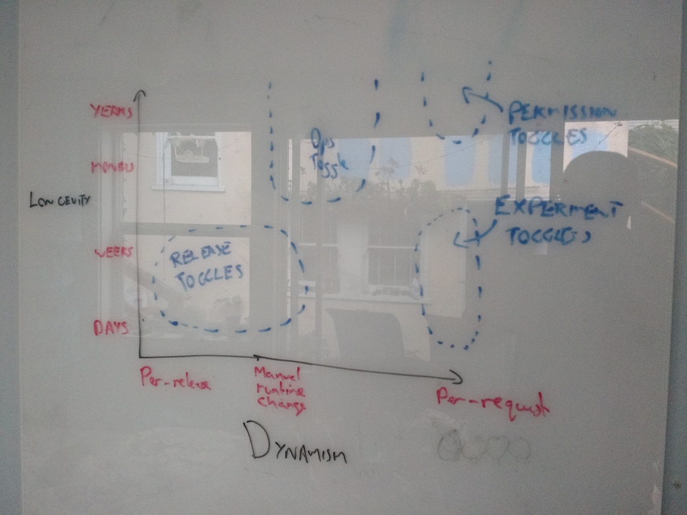
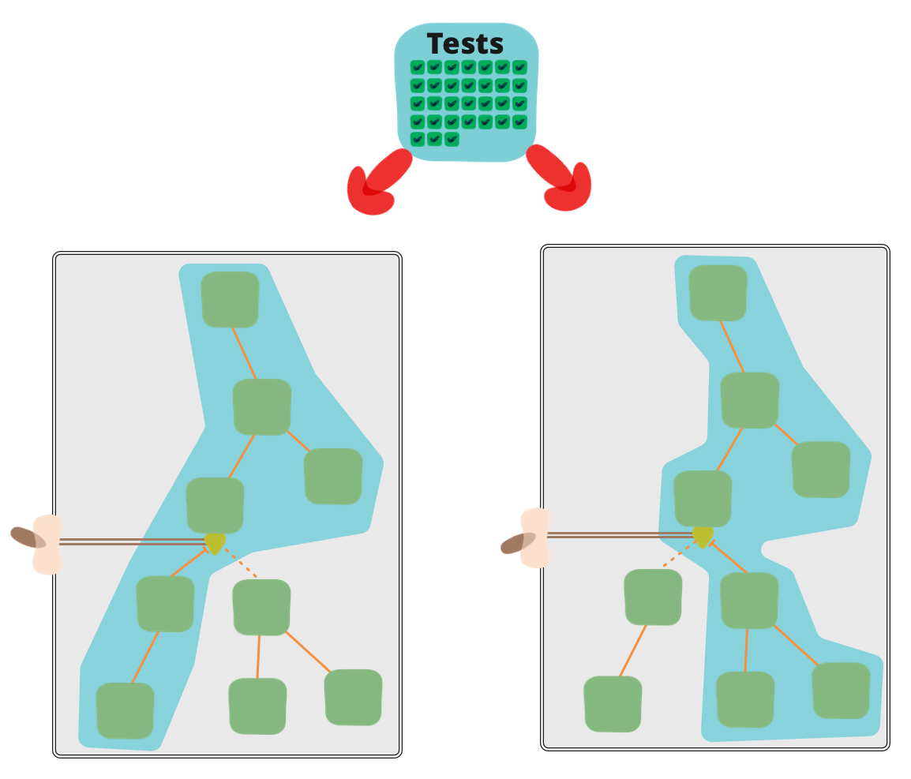

# Feature Toggles

## The back story
Picture the scene. You're on one of several teams working on a sophisticated town planning simulation game. Your team is responsible for the core simulation engine. You have been tasked with increasing the efficiency of the Spline Reticulation algorithm. You know this will require a fairly large overhaul of the implementation which will take several weeks. Meanwhile other members of your team will need to continue some ongoing work on related areas of the codebase. 

You want to avoid branching for this work if at all possible, based on previous painful experiences of merging long-lived branches in the past. Instead, you decide that the entire team will continue to work on trunk, but the developers working on the Spline Reticulation improvements will use a Feature Toggle to prevent their work from impacting the rest of the team or destabilizing the codebase.

## The birth of a Feature Toggle

Here's the first change introduced by the pair working on the algorithm:

``` javascript
////////////
// BEFORE
////////////

function reticulateSplines(){
  // current implementation lives here
}
```

``` javascript
////////////
// AFTER
////////////

function reticulateSplines(){
  var useNewAlgorithm == false;
  // useNewAlgorithm = true; // UNCOMMENT IF YOU ARE WORKING ON THE NEW SR ALGORITHM

  if( useNewAlgorithm ){
    return enhancedSplineReticulation();
  }else{
    return oldFashionedSplineReticulation();
  }
}

function oldFashionedSplineReticulation(){
  // current implementation lives here
}

function enhancedSplineReticulation(){
  // TODO: implement better SR algorithm
}
```

The pair have moved the current algorithm implementation into an `oldFashionedSplineReticulation` function, and turned `reticulateSplines` into a **Toggle Point**. Now if someone is working on the new algorithm they can enable the "use new Algorithm" **Feature** by uncommenting the `useNewAlgorithm = true` line.

## Making a toggle dynamic

A few hours pass and the pair are ready to run their new algorithm through some of the simulation engine's integration tests. They also want to exercise the old algorithm in the same integration test run. They'll need to be able to enable or disable the Feature dynamically, which means it's time to move on from the clunky mechanism of commenting or uncommenting that `useNewAlgorithm = true` line:

``` javascript
function reticulateSplines(){
  if( featureIsEnabled("use-new-SR-algorithm") ){
    return enhancedSplineReticulation();
  }else{
    return oldFashionedSplineReticulation();
  }
}
```
We've now introduced a `featureIsEnabled` function, a **Toggle Router** which can be used to dynamically control which code path is live. There are many ways to implement a Toggle Router, varying from a simple in-memory store to a highly sophisticated distributed system with a fancy UI. For now we'll start with a very simple system:

``` javascript
function createToggleRouter(featureConfig){
  // note that we're using ES6 method shorthand: https://developer.mozilla.org/en-US/docs/Web/JavaScript/Reference/Operators/Object_initializer#Method_definitions
  return {
    toggleFeature(featureName,isEnabled){
      featureConfig[featureName] = isEnabled;
    },
    featureIsEnabled(featureName){
      return featureConfig[featureName];
    }
  };
}
```

We can create a new toggle router based on some default configuration - perhaps read in from a config file - but we can also dynamically toggle a feature on or off. This is allows automated tests to verify both sides of a toggled feature.

## Getting ready to release

More time passes and the team believe their new algorithm is feature-complete. To confirm this they have been modifying their higher-level automated tests so that they exercise the system both with the feature off and with it on. The team also wants to do some manual exploratory testing to ensure everything works as expected - Spline Reticulation is a critical part of the system's behavior, after all. 

To perform manual testing of a feature which hasn't yet been verified as ready for general use we need to be able to have the feature Off for our general user base in production but be able to turn it On for internal users. There are a lot of different approaches to achieve this goal:

* Allow Toggle Configuration to be specified per-environment. Only turn the new feature on in a pre-production environment. 
* Allow Toggle Configuration to be modified at runtime via some form of Admin UI. Use that admin UI to turn the new feature on a test environment.
* Have a highly dynamic Toggle Router which can make per-request toggling decisions. These decisions take request context into account, perhaps by looking for a special cookie or HTTP header. The most common piece of request context to base a toggle routing decision on is the user making the request.

The team decides to go with a per-request Toggle Router since it gives them a lot of flexibility. Significantly, it allows the team to test their new algorithm without needing a seperate testing environment. Instead they can just turn the algorithm on in their production environment but only for internal users (as detected via a special cookie). The team can now turn that cookie on for themselves and verify that the new feature performs as expected.

## Canary releasing

The new Spline Reticulation algorithm is looking good based on the exploratory testing done so far. However since it's such a critical part of the game's simulation engine there remains some reluctance to turn this feature on for all users. The team decide to use their Feature Toggle infrastructure to perform a **[Canary Release](http://martinfowler.com/bliki/CanaryRelease.html)**, only turning the new feature on for a small percentage of their total userbase - a "canary" cohort. 

The Toggle Router is enhanced to become aware of the concept of user cohorts - groups of users who consistently experience a feature as always being On or Off. A cohort of canary users is created via a random sampling of 1% of the user base - perhaps using a modulo of user ID. This canary cohort will consistently have the feature turned on, while the other 99% of the user base remain using the old algorithm. Key business metrics (user engagement, total revenue earned, etc) are monitored for both groups to gain confidence that the new algorithm does not negatively impact user behavior. Once we are confident that the new feature has no ill effects we modify our Toggle Configuration to turn it on for the entire user base.

## A/B testing

The team's product manager learns about this approach and is quite excited. She suggests that the team use a similar mechanism to perform some A/B testing. The team have long debated whether modifying their crime rate algorithm to take pollution levels into account would increase or decrease the game's playability. They now have the ability to settle the debate using data. They plan to roll out a cheap implementation which captures the essence of the idea, controlled with a Feature Toggle. They will turn the feature on for a reasonably large cohort of users, then study how those users behave compared to a control group. This allows the team to make contentious product decisions based on data, rather than [HiPPOs](http://www.forbes.com/sites/derosetichy/2013/04/15/what-happens-when-a-hippo-runs-your-company/).


# Categories of toggles

The scenarios above demonstrate the core facility provided by Feature Toggles - being able to ship alternative codepaths within one deployable unit and choose between them at runtime. The scenarios above also show that this facility can be used in various ways in various contexts. It can be tempting to lump all feature toggles into the same bucket, but this is a dangerous path. The design forces at play for differnt categories of toggles are quite different, so managing them all in the same way can lead to pain down the road. 

Usage of feature toggles can vary across two major dimensions: how long the feature toggle will live and how dynamic its configuration must be. There are other factors to consider - who will manage the feature toggle, for example - but I consider longevity and dynamism to be the two big factors which guide how you manage toggles.

With those two dimensions in mind, let's consider various categories of toggle and see where they fit.

</img>

## Release Toggles

These are toggles used to enable trunk-based development for teams practicing Continuous Delivery. The allow in-progress features to be checked into a shared integration branch without preventing that branch from being ready to deploy to production at any time. Feature toggles allow incomplete and un-tested code paths to be shipped to production as [latent code](http://www.infoq.com/news/2009/08/enabling-lrm) which will never be turned on. 

Product managers may also use a product-centric version of this same approach to prevent half-complete product features from being exposed to their end users. For example, the product manager of an ecommerce site might not want to let users see a new Estimated Shipping Date feature which only works for one of the site's shipping partners, prefering to wait until that feature has been implemented for all shipping partners. Product Managers may have other reasons for not wanting to expose features even if they are fully implemented and tested. Feature release might be being coordinated with a marketing campaign, for example. Using Release Toggles in this way is the most common way to implement the Continuous Delivery principle of seperating [feature] release from [code] deployment.

Release Toggles are transitionary by nature. They should generally not stick around much longer than a week or two, although product-centric toggles may need to remain in place for a longer period. Release toggles do not need to be particularly dynamic. Flipping a toggle by rolling out a new release with a toggle configuration change is often perfectly acceptable for these use cases. 

## Experiment Toggles

These toggles are used to perform multivariate or A/B testing. Each user of the system is placed into a cohort and at runtime the Toggle Router will send a given user consistently down one code path or another based on which cohort they are in. By tracking the aggregate behaviour of different cohorts we can compare the effect of the two different code paths. This technique is commonly used to make data-driven optimizations to things such as the purchase flow of an ecommerce system, or the wording of a Call To Action button.

By their nature Experiment Toggles are highly dynamic. In terms of longevity they must be in place long enough to generate statistically significant results. They must also be applied consistently over their entire lifetime - users must be consistently routed through the same code path.

## Ops Toggles
These toggles are used to control operational aspects of our system's behavior. We might introduce an Ops Toggle when rolling out a new feature which has unclear performance implications so that system operators can disable or degrade that feature quickly in production if needed. 

Most Ops Toggles will be relatively short-lived - once confidence is gained in the operational aspects of a new feature the toggle should be retired. However it's not uncommon for systems to have long-lived "Kill Switches" which allow operators of production systems to gracefully degrade non-vital system functionality (e.g. removing the Product Recommendation panel in the home page) when the system is enduring unusually high load. I consulted with an online retailer which maintained Ops Toggles that could intentionally disable many non-critical features in their website's main purchasing flow just prior to a high-demand product launch. These type of long-lived Ops Toggles could be seen as a manually-managed [Circuit Breaker](http://martinfowler.com/bliki/CircuitBreaker.html).

The purpose of these toggles is to allow operators to quickly react to production issues, so they need to be re-configured very quickly - needing to roll out a new release in order to flip an Ops Toggle will likely be an unacceptable solution.

## Permissioning Toggles
These toggles are used to change the features or product experience that certain users receive. For example we may have a set of "premium" features which we only toggle on for our paying customers. Or perhaps we have a set of "alpha" features which are only available to internal users and another set of "beta" features which are only available to internal users plus beta users. I refer to this technique of turning on new features for a set of internal or beta users as a Champagne Brunch - an early opportunity to "[drink your own champagne](http://www.cio.com/article/122351/Pegasystems_CIO_Tells_Colleagues_Drink_Your_Own_Champagne)". 

A Champagne Brunch is similar in many ways to a Canary Release. The distinction between the two is that a Canary Released feature is exposed to a statistically random cohort of users while a Champagne Brunch feature is exposed to a specifically selected set of users.

When used as a way to manage a feature which is only exposed to premium users a Permissioning Toggle may be very-long lived compared to other categories of Feature Toggles - at the scale of multiple years in some cases. Additionally the toggling decision for a Permissioning Toggle will always be specific to the user making the request, which makes this a very dynamic toggle.

## Dynamic configuration vs dynamic routing
It's important to note that a toggle's state can change at run time for two reasons. Firstly, something like a Ops Toggle might be dynamically *re-configured* from On to Off in response to a system outage. Secondly, some categories of toggles such as Permissioning Toggles and Experiment Toggles make dynamic decision on toggle state for each request.


## Managing different categories of toggles

Now that we have some sense of how different categories of toggles vary in terms of dynamism and longevity, let's look at how that affects how we work with toggles of different categories.

### Dynamic vs. static toggles
{ diagram showing division } 

We can divide toggles into those whose toggle state is essentially static for a given code deployment vs those whose state can vary dynamically at runtime. It's also important to note that there are two ways in which a toggle's state might dynamically change at runtime. Firstly, something like a Ops Toggle might be dynamically *re-configured* from On to Off in response to a system outage. Secondly, some categories of toggles such as Permissioning Toggles and Experiment Toggles make a dynamic decision on toggle state for each request based on some request context such as which user is making the request.

Managing **configuration** via re-deployment is preferable, if the nature of the toggle allows it. This allows us to keep toggle configuration in source control, alongside the codebase being toggled. Coupling toggle configuration to the software it manages in this way has a big advantage; it means that a change to the toggle configuration will move through your Continuous Delivery pipeline in the exact same way as a code change would. This enables the full the benefits of CD - repeatable builds which are verified in a consistent way. It also greatly reduces the testing burden of toggles. There is no need to verify how the release will perform with both a toggle off and on, since that state is baked into the release and won't be changed. Another benefit of toggle configuration living side-by-side in source control is that we can easily see the state of the toggle in previous releases, and easily recreate previous releases if needed.

Note that even toggles whose state is highly dynamic can still have a configuration which is managed via re-deployment. Experiment Toggles will often fall into this category - we don't really need to be able to modify the parameters of an experiment at runtime. In fact doing so would likely make the experiemnt statistically invalid.

### Long-lived toggles vs transient toggles
{ diagram showing division } 
We can also distinguish between toggles which are essentially transient in nature vs. toggles which may be in place for years. If we're adding a Release Toogle which will be removed in a few days time then we can probably get away with a Toggle Point which does a simple if/else check on a Toggle Router. This is what we did with our spline reticulation example earlier:
``` javascript
function reticulateSplines(){
  if( featureIsEnabled("use-new-SR-algorithm") ){
    return enhancedSplineReticulation();
  }else{
    return oldFashionedSplineReticulation();
  }
}
```
However if we're creating a new Permissioning Toggle which we expect to stay around for a very long time then we certainly don't want to sprinkle if/else checks around in the guts of our code. Next we'll look at ways to implement Feature Toggle logic in a sustainable way.


# Implementation Techniques

Feature Toggles seem to begat rather messy Toggle Point code. These Toggle Points also seem to have a tendency to proliferate throughout a codebase. It's important to keep this tendency in check for any Feature Toggles in your codebase, and critically important if the Toggle will be long-lived. Let's look at a few patterns which help to reduce this issue.

## De-coupling decision points from decision logic

One common mistake with Feature Toggles is to couple the place where a toggling decision is made (the Toggle Point) with the logic behind the decision (the Toggle Router). Let's look at an example. We're working on the next generation of our ecommerce system. One of our new features will allow a user to easily cancel an order by clicking a link inside their order confirmation email. We're using feature toggles to manage the rollout of all our next gen functionality. Our initial feature toggling implementation looks like this:

``` javascript 
  ////////////////////////////
  // invoiceEmailler.js

  const features = fetchFeatureTogglesFromSomewhere();

  function generateInvoiceEmail(){
    const baseEmail = buildEmailForInvoice(this.invoice);
    if( features.isEnabled("next-gen-ecomm") ){ 
      return addOrderCancellationContentToEmail(baseEmail);
    }else{
      return baseEmail;
    }
  }
```

While generating the order confirmation email (aka invoice email) our InvoiceEmailler checks to see whether the `next-gen-ecomm` feature is enabled. If it is then the emailler adds some extra order cancellation content to the email.

While this looks like a reasonable approach, it's very brittle. The decision on whether to include order cancellation functionality in our invoice emails is wired directly to that specific feature flag - using a magic string, no less. Why should the invoice emailling code need to know that the order cancellation content is part of the next-gen feature set? What happens if we'd like to turn on some parts of the next-gen functionality without exposing order cancellation? Or vice versa? What if we decide we'd like to only roll out order cancellation to certain users? It is quite common for these sort of "toggle scope" changes to occur as features are developed. Also bear in mind that these toggle points to proliferate throughout a codebase. With our current approach since the toggling decision logic is part of the toggle point any change to that decision logic will require trawling through all those toggle points which have spread through the codebase.

Happily, [any problem in software can be solved by adding a layer of indirection](https://en.wikipedia.org/wiki/Fundamental_theorem_of_software_engineering). We can decouple a toggling decision point from the logic behind that decision like so:

``` javascript 

  ////////////////////////////
  // featureDecisions.js

  function createFeatureDecisions(features){
    return {
      includeOrderCancellationInEmail(){
        return features.isEnabled("next-gen-ecomm");
      }
      // ... additional decision functions also live here ...
    };
  }


  ////////////////////////////
  // invoiceEmailler.js

  const features = fetchFeatureTogglesFromSomewhere();
  const featureDecisions = createFeatureDecisions(features);

  function generateInvoiceEmail(){
    const baseEmail = buildEmailForInvoice(this.invoice);
    if( featureDecisions.includeOrderCancellationInEmail() ){
      return addOrderCancellationContentToEmail(baseEmail);
    }else{
      return baseEmail;
    }
  }
```

We've introduced a `FeatureDecisions` object, which acts as a collection point for any feature toggle decision logic. We create a decision method on this object for each specific toggling decision in our code - in this case "should we include order cancellation functionality in our invoice email". Right now that decision logic is trivial, but as that logic evolves we have a singular place to manage it. Whenever we want to modify the logic of that specific toggling decision we have a single place to go. We might want to modify the scope of the decision - for example which specific feature toggle controls the decision. Alternatively we might need to modify the reason for the decision - from being driven by a static feature toggle to being driven by an A/B experiment, or by an operational concern such as an outage in some of our order cancellation infrastructure. In all cases our invoice emailler can remain blissfully unaware of how or why that toggling decision is being made.


## Inversion of Decision

In the previous example our invoice emailler was responsible for asking the feature toggle system how it show perform. This means our invoice emailler has one extra concept it needs to be aware of, and an extra module it is coupled to. This makes the invoice emailler harder to work with and think about in isolation, including making it harder to test. As Feature Toggling has a tendancy to become more and more prevalent in a system over time we would see more and more modules becoming coupled to the feature toggle system as a global dependency. Not a good scenario.

In software design we can often solve these coupling issues by applying Inversion of Control. This is true in this case. Here's how we might de-couple our invoice emailler from our feature toggling system:

``` javascript

////////////////////////////
// invoiceEmailler.js

function createInvoiceEmailler(config){
  return {
    generateInvoiceEmail(){
      const baseEmail = buildEmailForInvoice(this.invoice);
      if( config.includeOrderCancellationInEmail ){
        return addOrderCancellationContentToEmail(email);
      }else{
        return baseEmail;
      }
    },

    // ... other invoice emailer methods ...
  };
}

////////////////////////////
// featureAwareFactory.js

function createFeatureAwareFactoryBasedOn(featureDecisions){
  return {
    invoiceEmailler(){
      return createInvoiceEmailler({
        includeOrderCancellationInEmail: featureDecisions.includeOrderCancellationInEmail
      });
    },

    // ... other factory methods ...
  };
}

```

Now, rather than our `InvoiceEmailler` reaching out to `FeatureDecisions` it has those decisions injected into it at construction time via a `config` object. `InvoiceEmailler` now has no knowledge whatsoever about feature toggling. It just knows that bits of its behavior can be configured at runtime. This also makes testing `InvoiceEmailler`'s behavior easier - we can test the way that it generates emails both with and without order cancellation content just by passing a different configuration option during test.

We've also introduced a `FeatureAwareFactory` to centralize the creation of these decision-injected objects. This is an application of the general Dependency Injection pattern. If a DI system were in play in our codebase then we'd probably use that system to implement this approach.

## Avoiding conditionals

In our examples so far our decision point has been implemented using an if statement. This might make sense for a simple, short-lived toggle. However point conditionals are not advised anywhere where you have several Toggle Points or where you expect the Toggle Point to be long-lived. A more maintainable alternative is to implement alternative codepaths using some sort of Strategy pattern:

``` javascript

////////////////////////////
// invoiceEmailler.js

function createInvoiceEmaillerWith(additionalContentEnhancer){
  return {
    generateInvoiceEmail(){
      const baseEmail = buildEmailForInvoice(this.invoice);
      return additionalContentEnhancer(baseEmail);
    },
    // ... other invoice emailer methods ...

  };
}

////////////////////////////
// featureAwareFactory.js

function identityFn(x){ return x; }

function createFeatureAwareFactoryBasedOn(featureDecisions){
  return {
    invoiceEmailler(){
      if( featureDecisions.includeOrderCancellationInEmail ){
        return createInvoiceEmailler(addOrderCancellationContentToEmail);
      }else{
        return createInvoiceEmailler(identityFn);
      }
    },

    // ... other factory methods ...
  };
}

```

Here we're applying a Strategy pattern by allowing our invoice emailler to be configured with a content enhancement function. `FeatureAwareFactory` selects a strategy when creating the invoice emailler, guided by its `FeatureDecision`. If order cancellation should be in the email it passes in an enhancer function which adds that content to the email. Otherwise it passes in an `identityFn` enhancer - one which has no effect and simply passes the email back without modifications.


# Toggle Configuration

We manage Feature Toggles via Toggle Configuration. For basic toggles this configuration will simply say whether a toggle is On or Off, and a Toggle Router is just responsible for relaying that static Toggle State to the Toggle Point. Other categories of toggle are more dynamic, and require more complex Toggle Routers. For example the Toggle Router for a Canary Release toggle will decide Toggle State dynamically for a given user, perhaps using some sort of consistent cohorting algorithm based on that user's id. Rather than reading a static toggle state from configuration this Canary Release Toggle Router might instead read a "canary percentage" configuration which would be used as an input into the cohorting algorithm.

Earlier we noted how different categories of toggles have different needs in terms of how dynamic their configuration is. There are various ways of managing toggle configuration. Some are very simple but less dynamic in nature, others are very powerful but come with additional complexity.

## Hardcoded Toggle Configuration
The most basic technique - perhaps so basic as to not be considered a Feature Toggle - is to simply comment or uncomment blocks of code. 
 For example:

``` javascript
  function reticulateSplines(){
    //return oldFashionedSplineReticulation();
    return enhancedSplineReticulation();
  }
```
Slightly more sophisticated than the commenting approach is the use of a preprocessor's `#ifdef` feature (if available).

Obviously this type of hardcoding doesn't allow dynamically re-configuring a toggle so this mechanism is only suitable for toggles where we're willing to follow a pattern of deploying code in order to re-configure the toggle.

## Parameterized Toggle Configuration
The build-time configuration provided by hardcoded configuration isn't dynamic enough for many Feature Toggle use cases. A simple approach which at least allows toggles to be re-configured without re-building an app or service is to specify Toggle Configuration via command-line arguments or environment variables. This is a simple and time-honored approach to toggling which has been around since well before anyone refered to the technique as Feature Toggling. However it comes with limitations. It can become unwieldy to coordinate configuration across a large number of processes, and changes to a toggle require either a re-deploy or at the very least a process restart (and probably privileged access to servers by the person re-configuring the toggle too).

## Toggle Configuration File
Another option is to read Toggle Configuration from some sort of structured file. It's quite common for this approach to Toggle Configuration to begin life as one part of a more general application configuration file.

With a Toggle Configuration file you can now re-configure a toggle by simply changing that file rather than re-building application code itself. However, although you don't need to re-build your app to toggle a feature in most cases you'll probably still need to perform a re-deploy in order to re-configure a toggle.

## Toggle Configuration in App DB
Using static files to manage toggle configuration can become cumbersome once you reach a certain scale. Modifying configuration via files is relatively fiddly. Ensuring consistency across a fleet of servers becomes a challenge, making changes consistently even more so. In response to this many organizations move Toggle Configuration into some type of centralized store, often an existing application DB. This is usually accompanied by the build-out of some form of admin UI which allows system operators, testers and product managers to view and modify Features Toggles and their configuration. 

## Distributed Toggle Configuration
Using a general purpose DB which is already part of the system architecture to store toggle configuration is very common; it's an obvious place to go once Feature Toggles are introduced and start to gain traction. However nowadays there are a breed of special-purpose hierarchical key-value stores which are a better fit for managing application configuration - services like Zookeeper, etcd, or Consul. These services form a distributed cluster which provides a shared source of environmental configuration for all nodes attached to the cluster. That configuration can be modified dynamically whenever required, with all nodes in the cluster automatically informed of the change - a very handy bonus feature. Managing Toggle Configuration using these systems means we can have Toggle Routers on each and every node in a fleet making decisions based on Toggle Configuration which is coordinated across the entire fleet. 

Some of these systems (such as Consul) come with an admin UI which provides a basic way to manage Toggle Configuration. However at some point a small custom app for administering toggle config is usually created.

## Overriding configuration

So far our discussion has assumed that all configuration is provided by a singular mechanism. The reality for many systems is more sophisticated, with overriding layers of configuration coming from various sources. With Toggle Configuration it's quite common to have a default configuration along with environment-specific overrides. Those overrides may come from something as simple as an additional configuration file or something sophisticated like a Zookeeper cluster. Be aware that any environment-specific overriding runs counter to the Continuous Delivery ideal of having the exact same bits and configuration flow all the way through your delivery pipeline. Keeping both your deployable units and your configuration as environment-agnostic as possible will lead to a simpler, safer pipeline. We'll re-visit this topic shortly when we talk about testing a feature toggled system.

### Per-request overrides
An alternative approach to a environment-specific configuration overrides is to allow Toggle State to be overridden on a per-request basis by way of a special cookie, query parameter, or HTTP header. This has a few advantages over a full configuration override. If a service is load-balanced you can still be confident that the override will be applied no matter which service instance you are hitting. You can also override toggles in a production environment without affecting other users, and you're less likely to accidentally leave an override in place. If the per-request override mechanism uses persistent cookies then someone testing your system can configure their own custom set of toggle overrides which will remain consistently applied in their browser. 

The downside of this per-request approach is that it introduces a risk that curious or malicious end-users may modify feature toggle state themselves. Some organizations may be uncomfortable with the idea that some unreleased features may be publically accessible to a sufficiently determined party. Cryptographically signing your override configuration is one option to alleviate this concern, but regardless this approach will increase the complexity - and attack surface - of your feature toggling system.

I elaborate on this technique for cookie-based overrides in [this post](http://blog.thepete.net/blog/2012/11/06/cookie-based-feature-flag-overrides/) and have also [documented a ruby implementation](http://blog.thepete.net/blog/2013/08/24/introducing-rack-flags/) open-sourced by myself and a ThoughtWorks colleague.

## Working with feature-toggled systems 
While feature toggling is absolutely a helpful technique it does also bring additional complexity. There are a few techniques which can help make life easier when working with a feature-togggled system.

### Expose current feature toggle configuration
It's always been a helpful practice to embed build/version numbers into a deployed artifact and expose that metadata somewhere so that a dev or tester can find out what specific code is running in a given environment. The same idea should be applied with feature toggles. Any system using feature toggles should expose some way for an operator to discover the current state of the toggle configuration. In an HTTP-oriented SOA system this is often accomplished via some sort of metadata API endpoint or endpoints. See for example Spring Boot's ['management' endpoints](http://docs.spring.io/spring-boot/docs/current/reference/html/production-ready-endpoints.html).

### Manage different toggles differently
As discussed earlier, there are various categories of Feature Toggles with different characteristics. These differences should be embraced, and different toggles managed in different ways, even if the different categories might often be controlled using the same technical machinery. 

Let's revisit our previous example of an ecommerce site which has a Recommmended Products section on the homepage. Initially we might have placed that section behind a Release Toggle while it was under development. We might then have moved it to being behind an Experiment Toggle to validate that it was helping drive revenue. Finally we might move it behind an Ops Toggle so that we can turn it off when we're under extreme load. If we've followed the earlier advice around de-coupling decision logic from decision points then these differences in toggle category should have had no impact on the decision point code at all. However from a toggle management perspective these transitions should absolutely have an impact. As part of transitioning from Release Toggle to an Experiment Toggle the way the toggle is configured will change, and likely move to a different area - perhaps into an Admin UI rather than a yaml file in source control. Product folks will likely now manage the configuration rather than developers. Likewise, the transition from Experiment Toggle to Ops Toggle will mean another change in how the toggle is configured, where that configuration lives, and who manages the configuration.

### Feature Toggles introduce validation complexity
With feature-toggled systems our Continuous Delivery process becomes more complex since we'll often need to test multiple codepaths for the same artifact as it moves through a CD pipeline. To illustrate why, imagine we are shipping a system which can either use a new optimized tax calculation algorithm if a toggle is on, or otherwise continue to use our existing algorithm. At the time that a given deployable artifact is moving through our CD pipeline we can't know whether the toggle will be turned on or off in production - that's the whole point of feature toggles after all. This means we must perform validation on our artifact both with the toggle flipped On and flipped Off. 

</img>

If your feature toggle system doesn't support runtime configuration then you may have to restart the process you're testing in order to flip a toggle, or worse re-deploy an artifact into a testing environment. This can have a very detrimental effect on the cycle time of your validation process, which in turn impacts the all important feedback loop that CI provides. To avoid this issue consider exposing an endpoint which allows for dynamic in-memory re-configuration of a feature toggle. These types of override becomes even more necessary when you are using things like Experiment Toggles where it's even more fiddly to exercise both paths of a toggle.

This ability to dynamically re-configure specific service instances is a very sharp tool. If used inappropriately they will cause a lot of pain and confusion in a production environment. As such this should only ever be used by automated tests, and possibly as part of manual exploratory testing and debugging. If there is a need for a more general-purpose toggle control mechanism for use in production environments it would be best built out using a grown-up distributed configuration system such as Consul or Zookeeper.

## Where to place your toggle

### Toggles at the edge
For categories of toggle which need per-request context (Experiment Toggles, Permissioning Toggles) it makes sense to place control for those toggles in the edge services of your system - i.e. the publicly exposed web apps that present functionality to end users. Here is where your user's individual requests first enter your domain and thus where you have the most context to make toggling decisions based on the user and their request. A side-benefit of placing toggle control at the edge of your system is that it keeps fiddly conditional toggling logic out of the core of your system. In many cases you can place your Toggle Point right at the point where you're rendering HTML, as in this Rails example:

``` erb
<%= if featureDecisions.showRecommendationsSection? %>
  <%= render 'recommendations_section %>
<% end %>
```

Placing your toggles at the edges also makes sense when you are controlling access to new user-facing features which aren't yet ready for launch. In this context you can again control access using a toggle which simply shows or hides UI elements. As an example, perhaps you are building the ability to [log in to your application using Facebook](https://developers.facebook.com/docs/facebook-login) but aren't ready to roll it out to users just yet. The implementation of this feature may involve changes in various parts of your architecture, but you can control exposure of the feature with a simple feature toggle at the UI layer which hides the "Log in with Facebook" button. In these situations the bulk of the unreleased functionality itself is often not actually inaccessible, it's just sitting at a url which is not discoverable by users.

### Toggles in the core 
There are other types of lower-level toggle which must be placed deeper within your architecture. These toggles are usually technical in nature, and control how some functionality is implemented internally. An example would be a Release Toggle which controls whether to use a new piece of caching infrastructure in front of a third-party API or just route requests directly to that API. Localizing these toggling decisions within the service whose functionality is being toggled is the only sensible option in these cases.

## Managing the carrying cost of Feature Toggles

Feature Toggles have a tendency to multiply rapidly, particularly when first introduced. They are useful and cheap to create and so often a lot are created. However toggles do come with a carrying cost. They require you to introduce new abstractions or conditional logic into your code. They also introduce a significant testing burden. Knight Capital Group's [$460 million dollar mistake](http://dougseven.com/2014/04/17/knightmare-a-devops-cautionary-tale/) serves as a cautionary tale on what can go wrong when you don't manage your feature toggles correctly (amongst other things).

Smart teams view the Feature Toggles in their codebase as inventory which comes with a Carrying Cost, and seek to keep that inventory as low as possible. In order to keep the number of feature toggles manageable a team must be pro-active in removing feature toggles that are no longer needed. Some teams have a rule of always adding a toggle removal work item onto the team's backlog whenever a Release Toggle is first introduced. Other teams put "expiration dates" on their toggles. Some go as far as creating "time bombs" which will fail a test (or even refuse to start an application!) if a toggle is still around after its expiration date. We can also apply Lean principles of reducing inventory and place a limit on the number of toggles a system is allowed to have at any one time. Once that limit is reached if someone wants to add a new toggle they will first need to do the work to remove an existing toggle.

